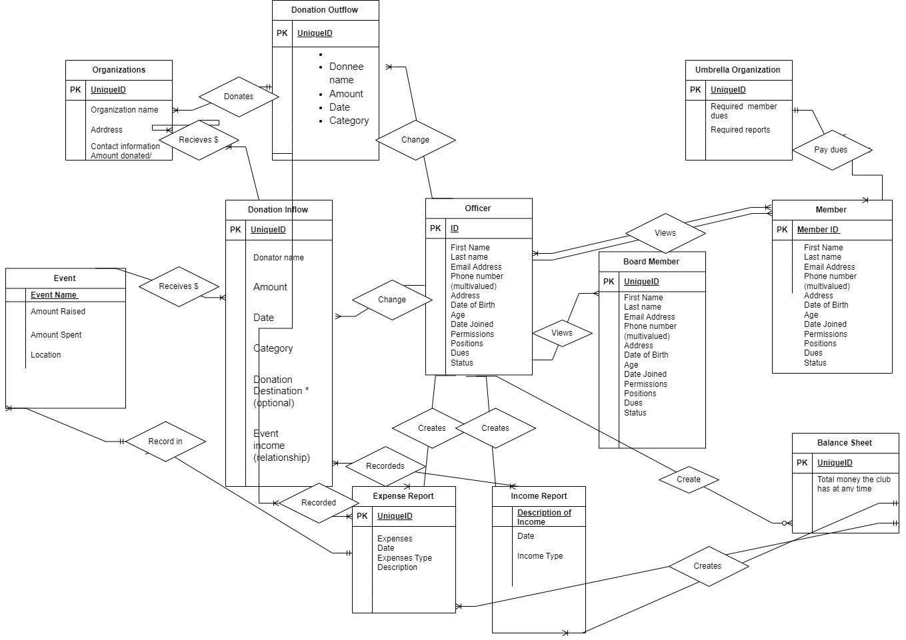

# Milestone 1: Business Rules and ER Diagram

## Business Rules

### Club Structure
- The club is governed by **4 officers** and **5 board members**.
- All officers have **full access to the database**.

### Membership
- Officers must be able to track both **current and past members** of the club.
- Access to members' contact information is essential, including:
  - First Name
  - Last Name
  - Address
  - Phone Number
  - Email
  - Status (Active/Inactive)
  - Dues

### Financial Operations
- Members are required to pay **annual dues**, which are contributed to both state and national umbrella organizations.
- The club's primary goal is fundraising, with proceeds donated to various recipient organizations categorized under:
  - Arts
  - Women
  - Children
  - Environment
- Specific annual donations include contributions to **FRYSC Berea Independent School District** every winter.
- Fundraising methods may include:
  - Painting Events
  - Art Events
  - Vendor Markets
  - Silent Auctions

### Donations and Expenses
- The club tracks **event registration fees** and has two main sources of donations:
  - Cash
  - In-Kind Donations (non-monetary items)
- Expenses include items such as PO Box fees, insurance, paperwork, and event costs.
- It is essential to monitor login and logout times.

### Reporting
- The system must generate reports for:
  - Expenses
  - Donations
  - Sources of cash
  - Categories of donations

### System Requirements
- The Treasurer's monitoring of incoming and outgoing funds is a priority.
- The system should be user-friendly for all club members.

## Entities

### Officer
- First Name
- Last Name
- Email Address
- Date of Birth
- Age
- Date Joined
- Phone Number (Multivalued)
- Address (Street, Zip, State) (Multivalued)
- ID
- Permissions
- Position
- Dues
- Status

### Board Member
- Similar structure to Officer.

### Member
- Name
- Email Address
- Phone Number (Multivalued)
- Address (Street, Zip, State) (Multivalued)
- Date of Birth
- Date Joined
- ID
- Permissions
- Position
- Dues
- Status

### Reports

#### Expense Report
- Date
- Expenses
- Expense Type
- Description of Expenses

#### Income Report
- Date
- Income Type
- Description of Income

#### Donation Inflow/Outflow
- Donator/Donee Name
- Amount
- Date
- Category
- Donation Destination (Optional for Inflow)

### Event
- Location
- Amount Raised
- Amount Spent
- Date
- Event Name

### Organization
- Organization Name
- Address
- Email Address
- Phone Number
- Amount Donated/Received
- Organization Type (Receiver or Giver)
- Nonprofit or For-Profit Status
- Category

### Umbrella Organization
- Required Member Dues (Status, Date)
- Required Reports (Status, Date)

### Balance Sheet
- Total Money at Any Time
- Date

## ER Diagram

