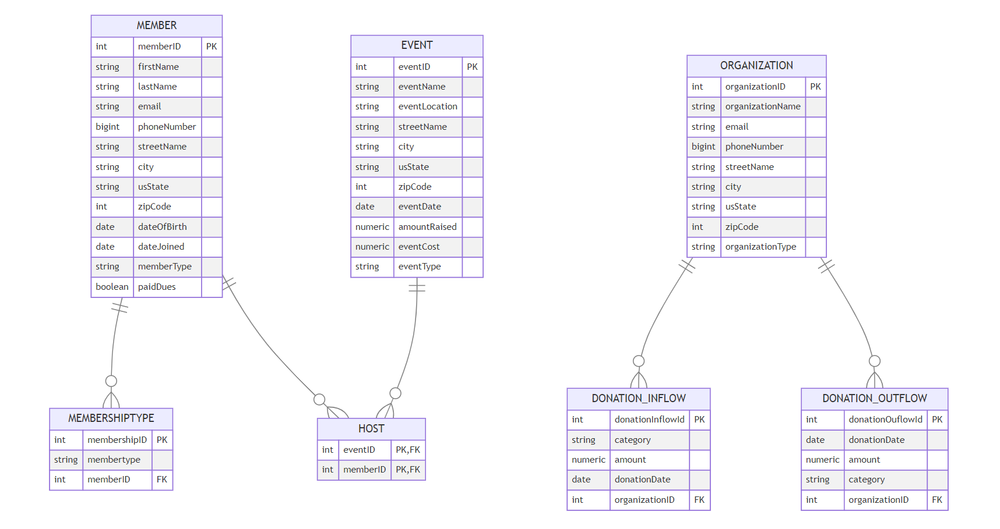

# 1. If not completed in Milestone 2, create a relational schema for your client database. Use lines to show Foreign Key relationships. Use text style notation (example below) and organize your relations so lines to not overlap.
## Schema

### Underlined = Primary Key 
### Italicized = Foreign Key 

- Member(Member ID, Organization ID, First name, Last Name, Email Address, Phone number, Address, date of birth , age, date joined, permissions)

- Host(Member ID, Event ID,Date )

- Employee Phone #(Member ID, Phone number)

- Event(Event ID, Amount raised, Amount Spent, Date, Donation inflow ID)

- Organization(Organization ID, Donation Outflow ID, Receiving, Address, Contact information, amount, Organization type, Donation Inflow ID)

- Donation Inflow(Donation Inflow ID, Donation Date, Donation name, Amount, Category, Member ID)

- Donation Outflow(Donation Outflow ID, Donation Date, Amount, Donee name, Category, Member ID)

# 2. Normalize your relations to at least 3NF. Write out new normalized schema, along with documentation of decisions. Your documentation should show proof of no partial or transitive dependencies. Save all in a file called "Relational Schema.md"

member Table: Initially, this table contained attributes related to both the member's personal information and their membership details (memberType). To adhere to 3NF, memberType was extracted into a new table (membershipType), since it could potentially create a transitive dependency through memberID to other member attributes. Now, every non-key attribute in the member table directly depends on the primary key (memberID), and there are no transitive dependencies, ensuring 3NF.
Removed Phone number as multi-valued and made it single valued (satisfied first normal form )
Removed Age since it was a functional dependency that was dependent on date of birth 
could not identify any transitive dependencies. 
membershipType Table: This new table contains membershipID as its primary key and memberType, with a foreign key referencing member(memberID). Since memberType directly depends on membershipID and there are no non-key attributes dependent on another non-key attribute, this table is in 3NF.

donationInflow Table: The primary key is donationInflowId. All attributes directly depend on the primary key, and there are no transitive dependencies among the non-key attributes. Thus, this table is in 3NF.

donation_Outflow Table: Similar to the donationInflow table, its primary key is donationOuflowId, and all non-key attributes are fully functionally dependent on it. There are no transitive dependencies, confirming it's in 3NF.

event Table: The primary key here is eventID. Each attribute in the table is directly dependent on eventID, and since there are no attributes that depend on other non-key attributes, this table also adheres to 3NF.

host Table: Serving as an associative entity that connects members to events, it has a composite primary key (eventID, memberID), where both are foreign keys. There are no non-key attributes, which inherently places this table in 3NF, as there cannot be any transitive dependencies without non-key attributes.

organization Table: The primary key is organizationID. Every non-key attribute is fully functionally dependent on organizationID, with no transitive dependencies. Thus, this table is in 3NF.

# 3. link to DatabaseCreate.sql script with finalized DDL statements
https://github.com/2024-databases-bereacollege/client-project-berea-women-s-club/blob/main/flaskapp/tables.sql
# 4. Models.py with peewee models
https://github.com/2024-databases-bereacollege/client-project-berea-women-s-club/blob/main/flaskapp/models.py
